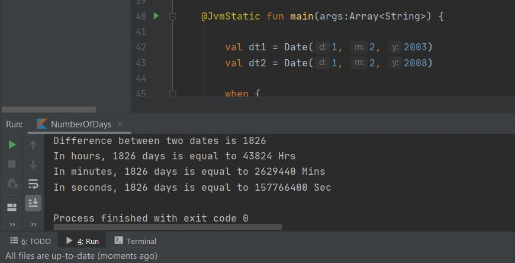
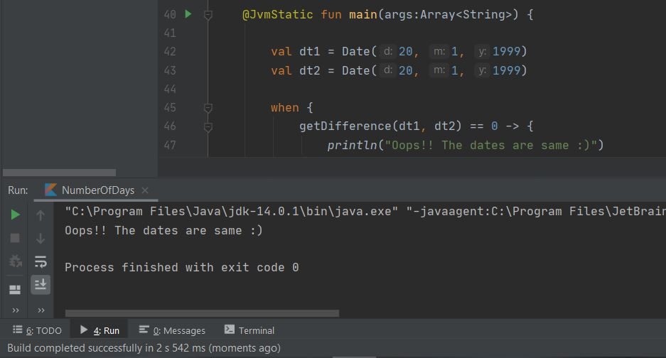
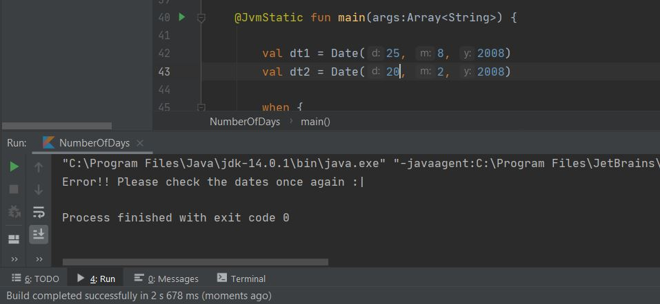

# Kotlin-Project

This repo is for the submission of the Kotlin Project as a part of #30DaysOfKotlin

The code when tested with different set of dates can give the number of days between the given two dates. 

Moreover, the code will also calculate the Hours, minutes, and seconds equivalent of the number of days that is calculated. (Case 1)

Also, if both the input dates are the same, instead of displaying 0 days, "Oops!! The dates are same :)" Message will be displayed. (Case 2)

And, if the 2nd date is older than the 1st date (Eg dt1 = 2,3,2005  and dt2 = 3,1,2004) then -ve value will not be displayed, instead, "Error!! Please check the dates once again :|" message will be displayed. (Case 3)

I have also added the screenshots of the above said cases after trying each one separately 

**The code for the project is available in the folder `src` with the name `App.kt`**

### Case 1 (When the dates are diffetent)

### Case 2 (When the dates are same)

### Case 3 (When the 2nd date is older than the 2st date)

